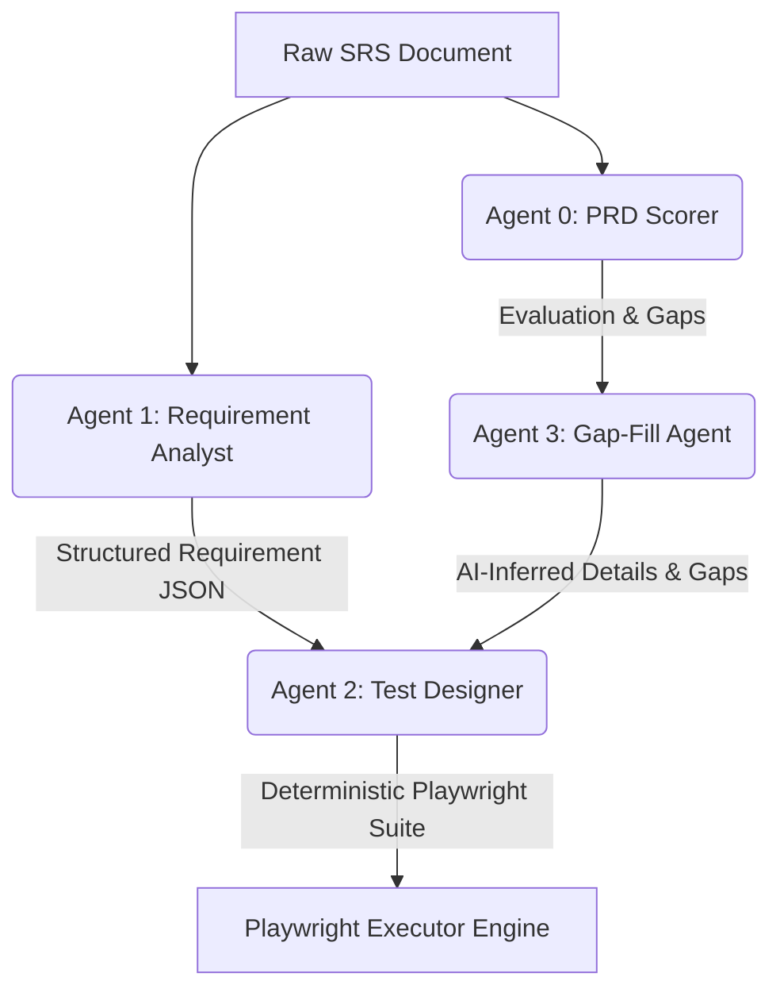

# TestGen AI Framework

TestGen AI is an automated, multi-agent QA framework designed to streamline and automate the entire software testing lifecycle. It bridges the gap between raw requirements and executable browser automation by analyzing Product Requirement Documents (PRDs/SRSs), building requirement models, generating test steps, executing test scripts, and compiling execution history.

---

## Key Features

1. **SRS Detailing & Scoring**: Evaluates requirement documents out of 100 based on completeness, inputs/outputs, edge cases, and exceptions, identifying gaps before coding starts.
2. **AI Requirement Modeling**: Automatically extracts functional requirements, input fields, validation constraints, and user flows into structured requirement models.
3. **Automated Test Generation**: Converts requirement models into atomic, executable test suites mapped to semantic browser actions.
4. **Execution & Reporting**: Runs test suites using a Playwright-based browser execution engine (headed/headless), captures failure screenshots, and streams execution logs in real time.
5. **Interactive Dashboard**: Full project dashboard with versioning, priority, Jira and Slack integrations, and regression flags.

---

## 📐 Architecture & Multi-Agent Design

The framework utilizes a collaborative multi-agent architecture where specialized agents handle distinct stages of the requirement-to-testing pipeline.



### Specialized AI Agents
* **Agent 0: PRD Scorer / Quality Gatekeeper** — Analyzes PRD/SRS for missing details and ambiguous constraints.
* **Agent 1: Requirement Analyst** — Normalizes functional constraints and user flows into structured JSON.
* **Agent 2: Test Designer & Specification Generator** — Converts JSON models into Playwright automation steps (e.g. click, fill, check).
* **Agent 3: Gap-Fill & Suggestions Agent** — Infers gaps highlighted by Agent 0 and recommends validating test cases.

---

## 🛠️ Technology Stack

### Frontend Components
* **Framework**: Next.js 16 (App Router, React 19)
* **Styling**: Tailwind CSS
* **Design System**: Shadcn UI & Radix UI primitives
* **State Management & Data Fetching**: Zustand & TanStack React Query

### Backend Components
* **Runtime & Framework**: Node.js & Express
* **Database**: MongoDB (via Mongoose ODM)
* **Real-Time Communication**: Socket.io (for streaming real-time browser execution logs)
* **Parsers**: `pdf-parse` & `mammoth` (DOCX extraction)
* **LLM Integration**: OpenAI API (defaulting to `gpt-4o`/`gpt-4o-mini`)
* **Automation**: Playwright (headed/headless runner, screenshot capture on failure)

---

## 📁 Repository Structure

* [backend/](file:///home/admin/tescase-genrator/backend) — Express application housing Mongoose models, AI agent services, and execution runners.
  * [backend/src/modules/](file:///home/admin/tescase-genrator/backend/src/modules) — Modular feature folders containing models, routes, controllers, and services.
  * [backend/package.json](file:///home/admin/tescase-genrator/backend/package.json) — Backend dependencies and scripts.
* [frontend/](file:///home/admin/tescase-genrator/frontend) — Next.js 16 dashboard UI built with Radix and Tailwind.
  * [frontend/src/app/](file:///home/admin/tescase-genrator/frontend/src/app) — Dashboard routes and application layout.
  * [frontend/package.json](file:///home/admin/tescase-genrator/frontend/package.json) — Frontend dependencies and scripts.

---

## ⚙️ Getting Started

### Prerequisites
* **Node.js** (v18+ recommended)
* **MongoDB** instance
* **OpenAI API Key**

### 1. Backend Configuration & Setup

1. Navigate to the backend directory:
   ```bash
   cd backend
   ```
2. Install the dependencies:
   ```bash
   npm install
   ```
3. Set up the environment variables. Create a [backend/.env](file:///home/admin/tescase-genrator/backend/.env) file:
   ```env
   PORT=5000
   MONGODB_URI=your_mongodb_uri
   OPENAI_API_KEY=your_openai_api_key
   
   # Optional Integrations
   JIRA_HOST=your_jira_host
   JIRA_EMAIL=your_jira_email
   JIRA_TOKEN=your_jira_token
   JIRA_PROJECT_KEY=your_jira_project_key
   
   LINEAR_API_KEY=your_linear_api_key
   LINEAR_TEAM_ID=your_linear_team_id
   ```
4. Install Playwright browser binaries:
   ```bash
   npx playwright install
   ```
5. Start the backend development server:
   ```bash
   npm run dev
   ```

### 2. Frontend Configuration & Setup

1. Navigate to the frontend directory:
   ```bash
   cd ../frontend
   ```
2. Install the dependencies:
   ```bash
   npm install
   ```
3. Set up the environment variables. Create a [frontend/.env](file:///home/admin/tescase-genrator/frontend/.env) file:
   ```env
   NEXTAUTH_SECRET=your_jwt_secret
   NEXTAUTH_URL=http://localhost:3000
   NEXT_PUBLIC_GOOGLE_CLIENT_ID=your_google_client_id
   
   # Integration Sync variables
   NEXT_PUBLIC_JIRA_HOST=your_jira_host
   NEXT_PUBLIC_JIRA_EMAIL=your_jira_email
   NEXT_PUBLIC_JIRA_TOKEN=your_jira_token
   NEXT_PUBLIC_JIRA_PROJECT_KEY=your_jira_project_key
   ```
4. Start the frontend development server:
   ```bash
   npm run dev
   ```

Open [http://localhost:3000](http://localhost:3000) in your browser to view the application.

---

## 💰 Token Consumption Control

To maintain cost efficiency and prevent API limits being hit:
* **Text Truncation**: Extracted SRS text is truncated to `100,000` characters maximum.
* **Minified JSON Output**: System prompts enforce output of raw, minified JSON objects instead of verbose descriptions or markdown.
* **Context Partitioning**: Downstream agents are fed parsed requirement models rather than the whole raw SRS document.
* **Low Temperatures**: Model temperature ranges from `0.1` to `0.3` to keep responses focused and concise.
* **Flexible Model Swapping**: Support for changing OpenAI models via environment variables (`gpt-4o-mini` is recommended for cost savings in development).
