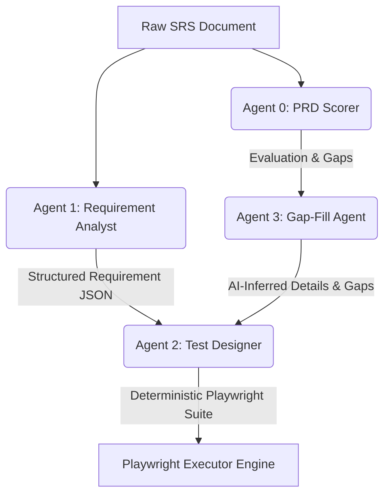

# Project Documentation: TestGen AI Framework

## 1. Introduction & Problem Statement
### The Problem We Are Solving
In modern software development, Quality Assurance (QA) remains one of the most time-consuming and manual phases of the delivery lifecycle. The traditional process of reading Product Requirement Documents (PRDs) or Software Requirement Specifications (SRSs), manually identifying test scenarios, converting them into structured test cases, writing automated test scripts, and running them is slow, expensive, and error-prone. 

Requirements are often vague, ambiguous, or incomplete, leading to developer guesswork and late-stage defects. Furthermore, linking executed test runs back to original business requirements (traceability) is difficult to maintain.

### The Solution: TestGen AI
TestGen AI is an automated, multi-agent framework designed to streamline and automate the entire software testing lifecycle:
1. **SRS Detailing & Scoring**: Analyzes requirement documents to score their quality, highlighting ambiguities and missing details before writing code.
2. **AI Requirement Modeling**: Automatically extracts functional requirements, input fields, validation constraints, and user flows into structured requirement models.
3. **Automated Test Generation**: Converts requirement models into atomic, executable test suites with browser-automation steps.
4. **Execution & Reporting**: Runs test suites using a Playwright-based browser execution engine (headed/headless), captures failure screenshots, and produces interactive status reports with complete execution histories.

---

## 2. Technology Stack

### Frontend Components
- **Framework**: Next.js (App Router, React 19)
- **Styling**: Tailwind CSS
- **Design System & Components**: Shadcn UI & Radix primitives
- **Icons**: Lucide React
- **Authentication**: NextAuth.js(Future)
- **Exports**: XLSX (Excel generation) & jsPDF

### Backend Components
- **Runtime**: Node.js & Express
- **Database**: MongoDB (via Mongoose ODM)
- **Real-Time Communication**: Socket.io (for streaming real-time browser execution logs)
- **Parsers**: `pdf-parse` & `mammoth` (DOCX extraction)

### Artificial Intelligence & Automation
- **LLM Services**: OpenAI API (with custom environment model support, defaulting to `gpt-4o`)
- **Automation Runner**: Playwright (deterministic browser simulation, action locator matching, screenshot capture on failure)

---

## 3. Agent Overview
TestGen AI leverages a collaborative multi-agent architecture where specialized agents handle distinct stages of the requirement-to-testing pipeline.



### Agent 0: PRD Scorer / Quality Gatekeeper
* **Role**: Requirements quality assessment.
* **Use Case**: Reads a PRD/SRS and scores it from 0 to 100 based on completeness, input/output specificity, exception handling, and edge cases. It provides a structured list of strengths, missing details, ambiguities, and recommendations to ensure a document is ready for development and testing.

### Agent 1: Requirement Analyst
* **Role**: Functional requirements parser.
* **Use Case**: Extracts functional requirements, business/validation rules, user roles, input fields, preconditions, and navigation flows, normalizing them into a machine-readable JSON schema.

### Agent 2: Test Designer & Specification Generator
* **Role**: Automation step designer.
* **Use Case**: Converts the structured requirement model from Agent 1 into deterministic, executable automated test suites. It maps steps to browser actions (like click, fill, check, select, or assertText) using semantic user-visible labels (e.g., `input:Email`, `button:Sign In`).

### Agent 3: Gap-Fill & Suggestions Agent
* **Role**: Ambiguity resolver.
* **Use Case**: Receives the gaps and missing details highlighted by Agent 0, provides reasonable AI-inferred requirements based on best industry practices, and suggests test cases specifically validating these filled gaps.

---

## 4. Features (Completed vs. Future)

The table below lists the current features of the framework along with status, assignments, and planned timelines:

| S.No. | Feature | Description | Status | Assigned | Timeline |
|:---:|---|---|:---:|:---:|:---:|
| **1** | Read and analyze SRS | Extract functional requirements, business rules, and user flows from uploaded SRS documents. | **Done** | Anurag | Completed |
| **2** | Convert project summary to test cases | Generate structured functional test cases from analyzed project summaries using AI. | **Done** | Anurag | Completed |
| **3** | Generate test steps with playwright actions | Convert test cases into executable Playwright steps with machine-readable automation actions. | **Done** | Abhinav | Completed |
| **4** | Execute test cases based on script | Run generated Playwright scripts and record execution results automatically. | **Done** | Abhinav | Completed |
| **5** | Capture screenshots on failure | Capture failure screenshots automatically and display them in the Execution UI. | **Done** | Abhinav | Completed |
| **6** | Create dashboard UI | Build a dashboard to manage projects, test cases, executions, and reports. | **Done** | Anurag | Completed |
| **7** | Add & edit test steps | Allow users to create, modify, and reorder test steps manually. | **Done** | Anurag | Completed |
| **8** | Implement modules/features | Organize test cases and documents into project modules and functional features. | **Done** | Anurag | Completed |
| **9** | Mark test cases as regressive | Flag test cases for inclusion in regression testing cycles. | **Done** | Abhinav | Completed |
| **10** | Assign priority to test cases | Categorize test cases by execution priority (High, Medium, Low). | **Done** | Abhinav | Completed |
| **11** | Login feature in dashboard | Implement secure user authentication and access control for the dashboard. | **Done** | Anurag | Completed |
| **12** | Connect Jira to sync tickets | Integrate Jira to sync tasks and test cases. | *Discussed* | TBD | Future |
| **13** | Connect Slack to assign issues | Send notifications and assign testing issues through Slack integration. | *Discussed* | TBD | Future |
| **14** | Add feature-wise SRS or document | Allow SRS or detail document upload for specific project features/modules. | **Done** | Anurag | Completed |
| **15** | Generate Project report | Generate execution reports with pass/fail statistics, QC cycle metrics, and insights. | **Done** | Abhinav | Completed |
| **16** | Versioning of test execution | Manage versioning of test cases execution and generating historical reports. | **Done** | Anurag | Completed |
| **17** | Improve UI and update dashboard design | Update the dashboard to follow premium BrowserStack-style UI aesthetics. | **Done** | Abhinav | Completed |

---

## 5. Token Consumption & Control Mechanisms

High token consumption is a common challenge when sending entire PRD/SRS documents to LLMs. To maintain cost efficiency and prevent context-window exhaustion, the framework implements the following token control mechanisms:

1. **Text Truncation Limit (`MAX_TEXT_LENGTH`)**:
   In [fileParser.service.js](file:///c:/Users/memor/Desktop/testcase-gen/backend/src/shared/fileParser.service.js#L6-L40), extracted text is limited to a maximum of `100,000` characters. Any content exceeding this boundary is automatically truncated, safeguarding backend processes from runaway input token charges.
   
2. **Minified Structured JSON Formats**:
   System prompts (like those in [requirement.prompt.js](file:///c:/Users/memor/Desktop/testcase-gen/backend/src/modules/requirement/requirement.prompt.js) and [testsuite.prompt.js](file:///c:/Users/memor/Desktop/testcase-gen/backend/src/modules/testsuite/testsuite.prompt.js)) instruct the models to output raw, minified JSON objects. By prohibiting markdown code blocks (` ```json `), descriptions, conversational filler, and conversational prose, the framework minimizes response token overhead.
   
3. **Atomic Prompt Structuring**:
   Prompts are optimized to restrict response verbosity. For example, Agent 0's arrays (e.g. `missing_details`, `ambiguities`) are strictly instructed to contain single concise sentences rather than multi-line descriptions.
   
4. **Low LLM Temperature Defaults**:
   Configured temperatures range from `0.1` (Agent 1) to `0.3` (Agent 3). Keeping temperatures low forces the models to remain focused on the input text, reducing verbosity and preventing redundant explanations or hallucinated content.
   
5. **Separation of Concerns (Context Partitioning)**:
   Instead of feeding the entire raw document to all agents, downstream agents like Agent 2 only receive the parsed JSON model created by Agent 1. This significantly reduces the size of input payloads for subsequent LLM invocations.
   
6. **Flexible Model Swapping**:
   Through the `OPENAI_MODEL` environment variable, developers can easily switch from high-tier models (like `gpt-4o`) to lightweight, highly cost-effective options (like `gpt-4o-mini`) in non-production environments to save up to 90% of model API costs.
